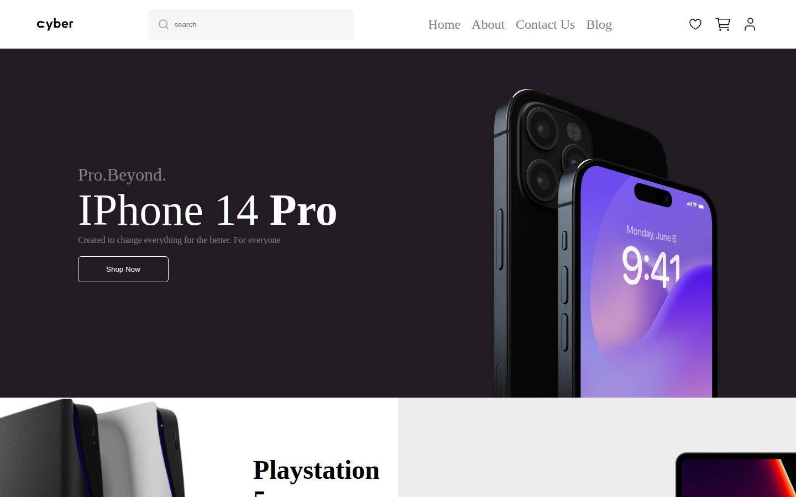

# Cyber — Electronics Store Home Page

A static home page for an electronics store: hero banner, featured products, category browser, product grid, and promotional banners. Built as HTML and CSS layout practice; the layout targets desktop screens.

| Hero and featured products | Full page |
| --- | --- |
|  |  |

## What's inside

- Header with search field, navigation, and icons
- Hero banner for the iPhone 14 Pro and featured product tiles
- Category browser and product grid with prices
- Summer sale banner, services, and footer

## Built with

- HTML
- CSS with Flexbox, Grid, and transitions

## Run locally

No build step. Open `index.html` in a browser.
